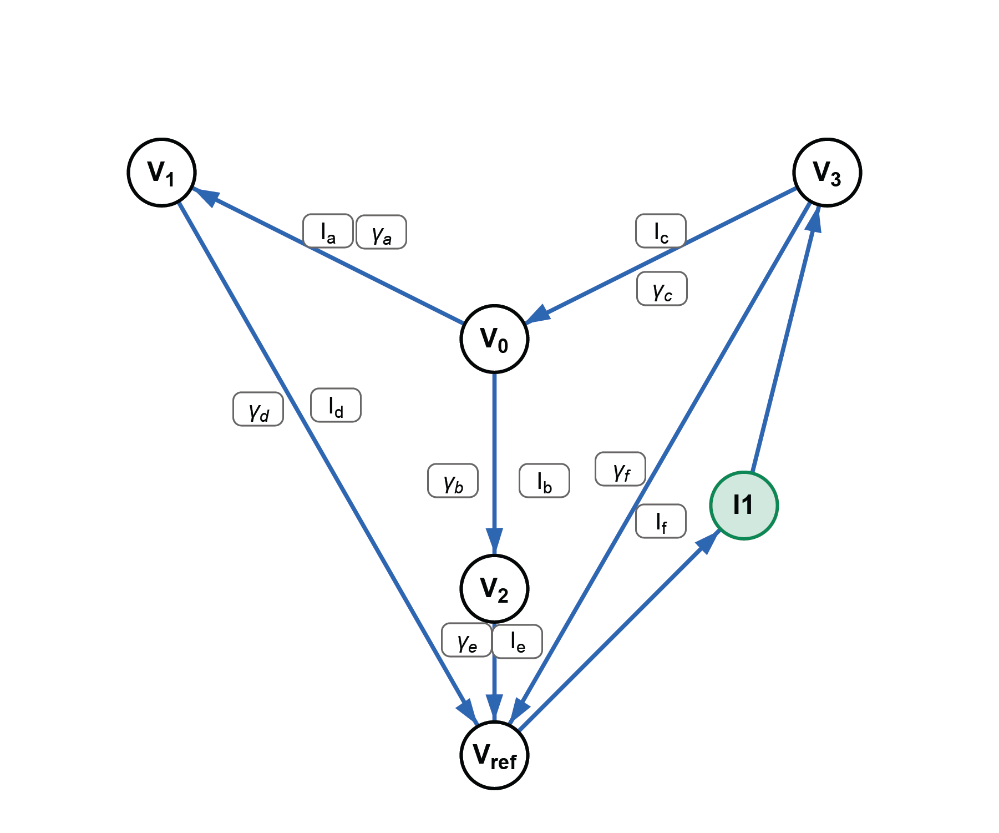

# Chapter 1

# Power Flow Analysis

## Introduction
Some introduction 

## Power Flow Fundamentals 
% Some fundamentals for Power Flow and optimal power flow

Power flow analysis is a method for studying characteristics of a powersystem e.g. to estimate the voltage leves, current flows, loading (and overloading) of components in the powersystem and, as the name indicates, how the power flows in the system. 

It is a study of steady state of a power system and may be used for further analysis with different load scenarios, changes in power flow in case of outage of components etc. 

It is essential a calculation of the neccessary output variables, given a set of input variables to satisfy Kirchhoff's Current Law.
The main variables investigated are: 
- voltage magnitude (V)
- voltage angle (/tetha)
- Active power(P)
- Reactive power(Q)

For power flow studies these variables can be investigated by defining a network of nodes and lines, where each node are equivalent of a busbar that can have both power generation and loads connected to it.
The nodes may be primary generation nodes or primary load nodes, but nodes may have both generation and load connected.
Generation loads are normally PV nodes (Active power(P) and voltages(V) are fixed), while load nodes are PQ nodes (Active power (P) and reactive power (Q) are fixed).
A system also needs a "Slack" node which, as the name indicates, picks up the slack. This node has a fixed voltage angle (equal to 0) and an absolute voltage value that is the reference for other nodes. 
It is also common to use a Per Unit value, denoted PU, for other nodes which is a factor related to the base voltage of the slack node.

To further investigate this, some basic definitions and dependencies must be defined:

Voltages:
The voltages in a line can be calculated as described in Equation 1 

$$ \overline{V_2} = \overline{V_1}- \frac{RP+XQ}{V} -j\frac{XP+RQ}{V}  \tag{numeq} $$

where R and X are the resistance and reactance of the line, and P and Q are the active and reactive power. (see page 164, eq 8.3)
or simpler:
$$ \overline{V_2} = \overline{V_1}- \Delta V_{Re} -j\Delta V_{Im} \tag{numeq} $$

As the reactance is normally orders of magnitude larger than resistance, this can be rewritten as the approximation:
$$ \Delta V_{Re} \approx \frac{XQ}{V_1} \tag{numeq}$$
$$ \Delta V_{Im} \approx \frac{XP}{V_1} \tag{numeq}$$
Takeaway: "The difference in voltage magnitude between the ends of the transmission line is mostly linked to the flow of reactive power through that line.
The difference in phase angle between the ends of a transmission line is mostly linked to the flow of active power through the line"
To handle calculation of these quantities in networks with many nodes, a node-analysis technique is used.
This is done by converting voltage sources into current source equivalents and impedances into admittance equivalents.
$$ \overline I_S = \frac{\overline V_S}{Z_S} \tag{numeq} $$
$$ Y_x= \frac{1}{Z_x} \tag{numeq} $$
To obey Kirchhoff's law, the sum of all currents entering a node must be zero.
For a simple network, this can be written as a sum of all currents flowing out of the node as positive and flowing to the node as negative (or vice versa).
(see example on page 166 in @{kirschen2024power})

![[Pasted image 20250128130031.png]]

*Figure 1: Example*

These equations can be re-written as the product of the admittance multiplied by the voltage drop.
In a very simple network with nodes 0, 1, 2 and 3 (Voltages are equal to \\(\overline V_n\\) ) where n is the node number and current \\(I_a\\) flowing from \\(V_0\\) to \\(V_1\\), \\(I_b\\) flowing from \\(V_0\\) to \\(V_2\\), and \\( I_c \\) flowing from \\( V_3\\) to \\( V_0 \\), (opposite direction). Then the Kirckhoffs law for node 0 will give the following sum:
$$ \overline I_a+ \overline I_b - \overline I_c = 0 \tag{numeq} $$
can be rewritten as
$$ Y_a(\overline V_0 - \overline V_1) + Y_b(\overline V_0 - \overline V_2) - Y_c(\overline V_3 - \overline V_0) = 0 \tag{numeq} $$
where \\(Y_n\\) is the admittance for each node
These may then be rewritten where each voltage is grouped
$$ (Y_a + Y_b + Y_c)\overline V_0 - (Y_a)\overline V_1 - (Y_b)\overline V_2 - (Y_c)\overline V_3 = 0 \tag{numeq} $$
To go further we need to also write the equations for the nodes \\(V_1 \\), \\(V_2\\), and \\( V_3\\) as well.
If we expand the network with a reference node (voltage = 0) and an unknown current source \\(I_1\\) and add the current flows \\(I_d\\) from node 1 to reference through \\(Y_d\\), \\(I_e\\) from node 2 to reference through \\(Y_e\\) and \\(I_f\\) from node 3 to reference through \\(Y_f\\) and finally add the current source between reference node and \\(V_3\\) we have the following equations.
For Node 1:
$$ Y_d(\overline V_1-0)-Y_a(\overline V_0-\overline V_1)=0 \tag{numeq} $$
For Node 2:
$$ Y_e(\overline V_2-0)- Y_b(V_0-V_2)=0 \tag{numeq} $$
For Node 3:
$$ Y_f(\overline V_3-0)+Y_c(\overline V_3 - \overline V_0) = I_1 \tag{numeq} $$
For the last Node 3, the sum is equal to I1 since this is an unknown(?) current source at this point.
When these are rewritten on the same form as (9)
For (10):
$$ (-Y_a)\overline V_0 + (Y_a+Y_d)\overline V_1 \tag{numeq} $$
For (11):
$$ (-Y_b)\overline V_0 + (Y_e+Y_b)\overline V_2 \tag{numeq} $$
for (12):
$$ (-Y_c)V_0 + (Y_c + Y_f)V_3 \tag{numeq} $$
This can then be written in matrix form

$$ \begin{bmatrix}  
Y_a + Y_b + Y_c& - Y_a & - Y_b & Yc \\\\
-Y_a & Y_a + Y_d & 0 & 0 \\\\
-Yb & 0 & Y_e + Y_b & 0 \\\\
-Yc & 0 & 0 & Y_c + Y_f
\end{bmatrix}
\begin{bmatrix}
\overline {V_0} \\\\ \overline {V_1} \\\\ \overline {V_2} \\\\ \overline {V_3}
\end{bmatrix} =
\begin{bmatrix}
0 \\\\ 0 \\\\ 0 \\\\ I_1
\end{bmatrix} 
$$

This matrice is symetrical along the diagonal and the values on the diagonal $ (i,i)$ elements are the admittance between the node (represented as columns in the matrix) and the reference node.
The elements not on the diagonal, the $(i,j)$ elements, are the negative admittances between nodes $i$ and $j$
This can be written more compact as 
$$ YV=I\tag{numeq}$$ 
or solved for $V$:
$$ V=Y^{-1}I \tag{numeq}$$

The Y matrix is often refered to as the admittance matrix and grows exponetially with the number of nodes, thus it is not feasible to solve for large networks. However, as most nodes are only connected to few nodes mostly (usually two or three other nodes) most of the elements in the Y matrix will be zero. 

#### Formulating the power flow problem
As each column in the Y matrix represents a node we can view one column in a nodal analysis.
If the column (or the node) $k$, in the matrix is concidered then Kirkhoffs law may be expressed as
$$\overline I_k = \sum_{i=1}^N Y_{ki}\overline V_i \tag{numeq}$$
Here $I_k$ represents the current that generators and loads inject to the node, while the sum represents the power from the node to other nodes. If we multiply this equation with the node voltage $\overline V_k$  we get the complex conjugate power injected at node $k$
$$ 
\overline V_k \overline I_k = \overline S_k = \sum_{i=1}^N Y_{ki}\overline V_k \overline V_i \tag{numeq}
$$

To evaluate this further it can be usefull to define the following:
$$Y_{ki} = G_{ki} + jB_{ki} \tag{numeq}$$
where $G$ and $B$ are just the Real, $[Re]$, and imaginary $[Im]$ part of $Y$
Further $V_k$ and $V_i$ can be expressed as amplitudes and angles:
$$\overline V_k = V_k \angle \theta_k \tag{numeq}$$ 
and 
$$\overline V_i = V_i \angle \theta_i \tag{numeq}$$

Using this in $(20)$ it can be rewritten as
$$\overline S_k = \sum_{i=1}^N (G_{ki} - jB_{ki}) V_k V_i \angle (\theta_k-\theta_i) \tag{numeq}$$
Changing to rectangular coordinates by isolating the $[Re]$ part with $cos$ and $[Im]$ part with $sin$ gives us
$$\overline S_k = \sum_{i=1}^N (G_{ki} - jB_{ki}) V_k V_i[cos(\theta_k-\theta_i)+jsin(\theta_k-\theta_i)] \tag{numeq}$$

This can then be rewritten by expanding and separating the real and imaginary parts so that we get:

$$P_k^{inj}= Re(\overline S_k) = \sum_{i=1}^{N}(V_k V_i[G_{ki}cos(\theta_k-\theta_i)+B_{ki}sin(\theta_k-\theta_i)])\tag{numeq}$$
$$Q_k^{inj}= Im(\overline S_k) = \sum_{i=1}^{N}(V_k V_i[G_{ki}sin(\theta_k-\theta_i)+B_{ki}cos(\theta_k-\theta_i)])\tag{numeq}$$

Based on these power flow equations we can solve the unknows but since the equations contain both variables multiplied with eachother and transcendental functions solving them requires an iterative approach. Since they are non-linear they cannot be solved analytically or directly @{kirschen2024power}. 

The Newton Raphson method is one way of a solution based on an iterative process where:
$$ x^{k+1}= x^k- \frac{f(x^k)}{f'(x^k)}\tag{numeq}$$ 
This is derived from a approximation based on the Taylor series with the second order derivative and further omitted.
$$ f(x) \approx f(x^0)+f'(x^0)(x-x^0)+\frac{1}{2}f''(x^0)(x-x^0)^2+....\tag{numeq}$$ 

From this the two first terms can be solved with respec to $x$ for the case where $f(x)=0$, which gives the  same expression as in (27). 
As we have several variables and functions to solve in the power flow equation case we need to concider the partial derivatives which can be written in taylor expansion as
$$ f(x,y) \approx f(x^0,y^0)+\frac{\partial(f(x^0,y^0))}{\partial x}(x-x^0) + \frac{f(x^0,y^0)}{\partial y}(y-y^0) \tag{numeq}$$
If we have more than one function (as in the case of power flow), these can be written as a set of equations, and rewritten on matrix form
$$ 
\begin{bmatrix}
f(x^0,y^0)+\frac{\partial(f(x^0,y^0))}{\partial x}(x-x^0) + \frac{\partial f(x^0,y^0)}{\partial y}(y-y^0)=0\\\\
g(x^0,y^0)+\frac{\partial(g(x^0,y^0))}{\partial x}(x-x^0) + \frac{\partial g(x^0,y^0)}{\partial y}(y-y^0)=0\\\\
\end{bmatrix} \tag{numeq}
\Rightarrow
$$
$$
\begin{bmatrix}
\frac{\partial(f(x^0,y^0))}{\partial x}&\frac{f(x^0,y^0)}{\partial y}\\\\
\frac{\partial(g(x^0,y^0))}{\partial x}&\frac{\partial g(x^0,y^0)}{\partial y}\\\\
\end{bmatrix}
\begin{bmatrix}
x-x^0\\\\
y-y^0
\end{bmatrix}=
-\begin{bmatrix}
f(x^0,y^0)\\\\
g(x^0,y^0)
\end{bmatrix}
$$

The matrix with the partial derivatives is called the Jacobian matrix, denoted $J(x,y)$ and is used to solve iteratively by re-writing the matrix equations:
$$
\begin{pmatrix}
x\\\\y
\end{pmatrix} =
\begin{pmatrix}
x^0\\\\y^0
\end{pmatrix}
-J(x^0, y^0)^{-1}
\begin{pmatrix}
f(x^0, y^0)\\\\
g(x^0, y^0)
\end{pmatrix}
\tag{numeq}$$

Usually $x$ is denoted $x^{k+1}$ and $x^0$ as $x^k$ to indicate the current step and next step of the iteration

To use this on power flow equations with $N$ number of buses where one is assumed to be the slack ($P$ and $Q$ are unknown) and 2 to $m$ are PV buses ($Q$ and $\theta$ are unknown) and the rest are PQ buses ($V$ and $\theta$ are unknown) there will be $2N-m-1$ unknown variables and $2N-m-1 $ non-linear euqations where the unknowns 
for a three bus system with one slack bus (k=1), one PV bus (k=2) and one PQ bus (k=3) $N=3, m=2, 2N-m-1$ gives 3 equations and 3 unknowns. The equations would look like this
$$P_2(\theta_2, \theta_3, V_3) = \sum_{i=1}^N(v_2V_i[G_{2i}cos(\theta_2-\theta_i)+B_{2i}sin(\theta_2-\theta_i)]-P_2^{inj})\tag{numeq}$$
$$P_3(\theta_2, \theta_3, V_3) = \sum_{i=1}^N(v_3V_i[G_{3i}cos(\theta_3-\theta_i)+B_{3i}sin(\theta_3-\theta_i)]-P_3^{inj})\tag{numeq}$$
$$Q_3(\theta_2, \theta_3, V_3) = \sum_{i=1}^N(v_3V_i[G_{3i}sin(\theta_3-\theta_i)+B_{3i}cos(\theta_3-\theta_i)]-P_3^{inj})\tag{numeq}$$

re-writen to netwon Rapshon equations on matrix form this would be
$$
\begin{pmatrix}
\theta_2^{k+1}\\\\
\theta_3^{k+1}\\\\
V_3^{k+1}
\end{pmatrix}=
\begin{pmatrix}
\theta_2^{k}\\\\
\theta_3^{k}\\\\
V_3^{k}
\end{pmatrix} -J^{-1}
\begin{pmatrix}
P_2(\theta_2^{k},\theta_3^{k},V_3^{k})\\\\
P_3(\theta_2^{k},\theta_3^{k},V_3^{k})\\\\
Q_3(\theta_2^{k},\theta_3^{k},V_3^{k})
\end{pmatrix}
\tag{numeq}$$
where the Jacobi matrix is:
$$
\begin{bmatrix}
\frac{\partial P_2}{\partial \theta_2} & \frac{\partial P_2}{\partial \theta_3} & \frac{\partial P_2}{\partial V_3}\\\\
\frac{\partial P_3}{\partial \theta_2} & \frac{\partial P_3}{\partial \theta_3} & \frac{\partial P_3}{\partial V_3}\\\\
\frac{\partial Q_3}{\partial \theta_2} & \frac{\partial Q_3}{\partial \theta_3} & \frac{\partial Q_3}{\partial V_3}
\end{bmatrix}
$$
these partial derivatives are found as follows (as described in @{kirschen2024power} page 177):
##### For the angles:
for the $P_k$ and $\theta_k$:
$$\frac{\partial P_2}{\partial \theta_2} = \sum_{i=1, i \neq 2}^{N}(V_2V_i[-G_{2i}sin(\theta_2-\theta_i)+B_{2i}cos(\theta_2-\theta_i)]) \tag{numeq}$$
$$\frac{\partial P_3}{\partial \theta_3} = \sum_{i=1, i \neq 3}^{N}(V_3V_i[-G_{3i}sin(\theta_3-\theta_i)+B_{2i}cos(\theta_3-\theta_i)]) \tag{numeq}$$

for the $P_k$ and $\theta_{i\neq k}$:
$$\frac{\partial P_2}{\partial \theta_3} = (V_2V_3[G_{23}sin(\theta_2-\theta_3)-B_{23}cos(\theta_2-\theta_3)]) \tag{numeq}$$
$$\frac{\partial P_3}{\partial \theta_2} = (V_3V_2[G_{32}sin(\theta_3-\theta_2)-B_{32}cos(\theta_3-\theta_2)]) \tag{numeq}$$

for the $Q_k$ and $\theta_k$:
$$\frac{\partial Q_3}{\partial \theta_3} = \sum_{i=1, i \neq 3}^{N}(V_3V_i[G_{3i}cos(\theta_3-\theta_i)+B_{2i}sin(\theta_3-\theta_i)]) \tag{numeq}$$

for the $Q_k$ and $\theta_{i \neq k}$:
$$\frac{\partial Q_3}{\partial \theta_2} = \sum_{i=1, i \neq 3}^{N}(V_3V_i[-G_{3i}cos(\theta_3-\theta_i)-B_{2i}sin(\theta_3-\theta_i)]) \tag{numeq}$$

###### For the voltages
for the $P_k$ and $V_k$:
$$\frac{\partial P_3}{\partial V_3} = \sum_{i=1, i \neq 3}^{N}(V_i[G_{3i}cos(\theta_3-\theta_i)+B_{3i}sin(\theta_3-\theta_i)]+2G_{33}V_3) \tag{numeq}$$

for the $P_k$ and $V_{i \neq k}$:
$$\frac{\partial P_3}{\partial V_2} = (V_3[G_{32}cos(\theta_3-\theta_2)+B_{32}sin(\theta_3-\theta_2)]) \tag{numeq}$$

for the $Q_k$ and $V_k$:
$$\frac{\partial Q_3}{\partial V_3} = \sum_{i=1, i \neq 3}^{N}(V_i[G_{3i}sin(\theta_3-\theta_i)+B_{3i}cos(\theta_3-\theta_i)]+2B_{33}V_3) \tag{numeq}$$

Since there are no instances of $Q_k$ and $V_{i \neq k}$ there is no need to calculate, but the general form of this is:
$$\frac{\partial Q_k}{\partial V_i} = (V_kV_i[G_{ki}sin(\theta_k-\theta_i)+B_{ki}sin(\theta_k-\theta_i)]) \tag{numeq}$$

The voltages and angles can then be found by solving (35) iteratively. When these are found the current and flow in each branch can be found using the admittance and voltages. For node i the current flowing into node i form node k is :
$$\overline{I_{ik}} = Y_{ik}(\overline{V_i}-\overline{V_k})\tag{numeq}$$
Normally there is a shunt-admittance to consider so the (36) is then
$$\overline{I_{ik}} = Y_{ik}^{se}(\overline{V_i}-\overline{V_k})+Y_{ik}^{sh}(\overline{V_k})\tag{numeq}$$

The power flowing through the branch (from i to k) can be found as:
$$\overline{S_{ik}} = P_{ik}+jQ_{ik}= \overline{V_i}\space\overline{I_{ik}}^* = Y_{ik}^{se*}(\|V_i|^2-\overline{V_i}\space\overline{V_{k}}^{*})+Y_{ik}^{sh*}|V_k|^2\tag{numeq}$$

As an example of how the results may look a load flow using the IEEE 9-bus system can be used. 
The below 9-bus network is simulated with varying loads as indicated:

When load flow calculation is ran with 15 timeframes (with varying load) the results may look as follows:

*Figure 2: Bus results*

*Figure 3: Line results*

In Figure 2 the Active power (P), Reactive Power (Q), voltage angle ($ \theta$) and voltage amplitude (V) for each bus is shown. 
We can observe that the slack bus active power (in blue in the top plot) varies corresponding to the aggregated change in loads in bus 5, 7 and 9 (purple, pink and yellow). 
All the loads are in negative values as pr. load flow convention, so they can easiliy be identified in the bottom of the plot. 
As the loads decreases in the right part of the x-axis(time) it can also be observed that the generation at the slack bus is actually negative. 
The reactive power in the loads also varies but in a different pattern, so that the total reacive power remains more or less the same throughout the simulations. The voltage magnitude and angle in each bus changes corresponding to the load changes and following change in injected power (P and Q). 

As the P and Q in loads are varying with the same pattern it is not obvious wether the angle and magnitudes change as a result of changes in P or Q, 
but if we investigate the equations 36 to 44 we may observe that the changes in P and Q related to V and $ \theta$ are dependent on the sine and cosine of the angle between two nodes, multiplied by the G and B of the admittance.
If we assume that the difference in angles are relatively small the sine term is relatively small and can for the purpose of understanding the relation be neglected, while the the cosine term is relatively large and may be concidered $ \approx 1 $ for the purpose of understanding the relation. 
For the P and $ \theta$ relation is dependent on the cosine multiplied with the B from (20) which is related to the reactance portion of the impedance which is significant for large $\frac{R}{X}$ ratios typically found in distribution grids
The P and V relation is dependent on the cosine multiplied by G from (20) which is related to the resistance part of the impedance, which again is relatively low for large $\frac{R}{X}$ ratios.

Similarly the Q and $ \theta$ relation and Q and V relation are oposite, cosine is multiplied with G (related to resistance part of impedance) for the $\frac{\partial Q}{\partial V}$ relation and with B (related to reactance part of impedance) for the $\frac{\partial Q}{\partial \theta}$ relation.
Thus we should expect, given a large $\frac{R}{X}$ that the $\frac{\partial P}{\partial \theta}$ and $\frac{\partial Q}{\partial V}$ have a larger impact than the $\frac{\partial Q}{\partial \theta}$ and $\frac{\partial P}{\partial V}$

If we re-run the simluations with Q and P varying separately from eachother we may observe this relation more clearly as shown in figure 4 below.

*Figure 4: Bus results with independent variation in P and Q*

In Figure 4 the increase and deacease in P and Q can be observed in the purple, pink and yellow lines for bus 5, 7 and 8.

In Figure 3 the line results are shown. Here the S_nom for each line is plotted as red lines for. As can be observed for lines 3, 7 and 9 there are some timesteps where the power flow exceeds the line capacity. 
This can be resolved by changing the setpoints for genertors in bus 2 and 3 but it is not obvious what they should be. Changing the setpoint may cause new issues.
### Optimal Power Flow (OPF)
General principles
The Optimal Power Flow (OPF) is used to find optimal ways to redispacth generation in  a power flow analysis to optimize for particular objective(s).
Optimization can be viewed as a very simple economical optimization where the cost of energy is minimized based on a set of controllable actions such as the active power, reactive power and voltage for Slack and PV buses. 
Other controllable actions may be tap changers for transformers or reactive power compenstation devices. 

Furthermore there are some constraints such as branch nominal power ratings and voltage magnitudes to concider. 
When using PyPSA as for the calculations and plots above there are some build in methods for solving optimal power flow. (Add more later?)

#### Optimization techniques

To optimize the power flow we first need some techniques for optimizing. A set of (x)? optimization techniques and algoritms are described below.

In essence optimization techniques are based on developing a mathematical model for your system that can then be used to minimize or maximize an output. For power systems, minimizing losses, maximizing capacity utilization etc. can be relevant outputs to model and optimize.  

The way these models are developed and how the optimization is solved can vary.

##### Linear programming
If the model can be expressed as a set linear equations and maximum or minimum of the outputs are what we look for then linear programming can be used. 

Something more or delete?

##### Taylors Theoreme

For a singel variable system we can model this as a function $f(x)$, we can simply define the derivative of the function and find the values where $f'(x)=0$ to find the minimum and maximum values for $f(x)$. 
For multiple variable systems such as $f(x_1,x_2,...x_n)$ the an optimum can be found for where all the partial derivatives are zero:
$$\frac{\partial f(x_1,x_2,...x_n)}{\partial x_1} =0,  
\frac{\partial f(x_1,x_2,...x_n)}{\partial x_2} =0,...
\frac{\partial f(x_1,x_2,...x_n)}{\partial x_n} =0 $$

This is a requirement for a optimum, but does not neccessarily mean that all solutions are real minimums or maximums as there can be local (or weak) minimums and maximums. 
Local optimums are the points ($x_0$) there this requirements are satisfied, but there are other points within the limits where $f(x)>f(x_0)$ (for maximums) or  $f(x)<f(x_0)$ (for minimums)

Further there must be convexity and/or concavity in the functions in order to find optimums. Functions can be both convex and concave. A definition of a convex function can be expressed as a function $f(x)$ is convex if :
$$ f[\lambda x_2+(1-\lambda)x_1] \leq \lambda f(x_2) + (1-\lambda)f(x_1)\tag{numeq}$$
and concave if:  
$$ f[\lambda x_2+(1-\lambda)x_1] \geq \lambda f(x_2) + (1-\lambda)f(x_1)\tag{numeq}$$
for a range of $x \in [x_{min},x_{max}]  $ where any two points $x_1$ and $x_2$ in this interval and all values for $\lambda \in [0,1]$ satisfy either of the two equations.

This is relevant as a function that is convex with a constraint set that is convex can be shown to have an uniqe solution. However this is not the genral case for power flow problems as this are, in general, non-convex. Contrary there is usually more than one minima and the difference can be significant.

The Taylor expansion can be used to find if a function $f(x)$ has an optimum by assessing the first term in the taylor series.

$$f(a) = f(a) + f'(a)(x-a) + \frac{f''(a)}{2!}(x-a)^2+...+\frac{f^n(a)}{n!}(x-a)^n\tag{numeq}$$
For two points $x_1$ and $x_2$ where $x_2 = x_1 + h$ we can define $\theta$ such that $0 \leq \theta  \leq 1$ and the the Taylor series can be rewritten as
$$f(x_2)= f(x_1)+ hf'(x_1) +\frac{h^2}{2!}f''(x_1)+...+\frac{h^n}{n!}f^{(n)}[\theta x_1+(1-\theta)x_2]\tag{numeq}$$
For functions of multivariables this can be written with a vector of gradients (including only the first order derivatives):
$$f(\overline x_2) = f(\overline x_1) +\overline{\nabla} f[\theta x_1+(1-\theta)x_2]h\tag{numeq}$$
where
$$\overline{\nabla}f = \begin{pmatrix}\frac{\partial f}{\partial x_1},& \frac{\partial f}{\partial x_2}&\ldots& \frac{\partial f}{\partial x_n} \end{pmatrix}\tag{numeq}$$

This gradient vector of first order partial derivatives points in the direction of the steepes ascent($\nabla f$) or descent($-\nabla f$) 

including the 2nd order derivatives can be done by defining what is called the Hessian matrix of second order partial derivatives:
$$ H=
\begin{bmatrix}
\frac{\partial ^2f(x_1,...x_n)}{\partial x_1\partial x_1} & \frac{\partial ^2f(x_1,...x_n)}{\partial x_1\partial x_2}&\cdots&\frac{\partial ^2f(x_1,...x_n)}{\partial x_1\partial x_n}\\
\frac{\partial ^2f(x_1,...x_n)}{\partial x_2\partial x_1} & \frac{\partial ^2f(x_1,...x_n)}{\partial x_2\partial x_2}  & \cdots & \frac{\partial ^2f(x_1,...x_n)}{\partial x_2\partial x_n}\\
\vdots&\vdots & \ddots & \vdots\\
\frac{\partial ^2f(x_1,...x_n)}{\partial x_n\partial x_1} & \frac{\partial ^2f(x_1,...x_n)}{\partial x_n\partial x_3} & \cdots & \frac{\partial ^2f(x_1,...x_n)}{\partial x_n\partial x_n}
\end{bmatrix}
$$
The taylor series for the multivariable functioncan then be written as
$$f(\overline x_2)=f(\overline x_1) + \nabla f(x_1)^Th+\frac1 2h^TH_f[\theta x_1 + (1-\theta)x_2]h \tag{numeq}$$

The Hessian can be implemented in the Newtons method  to iteratively find minima. Compared to the earlier forumalting we now use the following update rule:
$$x_{k+1} = x_k- H^{-1}(x-k) \nabla f(x_k)\tag{numeq}$$

The Hessian $(H_f)$ can also be used to decide it the point(s) where $\nabla f=0$ are minimum ($H_f$ is positive definite), maximum ($H_f$ is negative and definite) or sadle points ($H_f$ has both positive and negative eigenvalues)

In the plots below the functions $f(x,y) = x^2+y^2$, $g(x,y) = -x^2-y^2$ and $h(x,y) =x^2-y^2$ for the point $f(0,0)$ would have a Hessian matrix of
$$H_f=\begin{bmatrix}
\frac{\partial^2 f}{\partial x^2} & \frac{\partial^2 f}{\partial x \partial y} \\ \frac{\partial^2 f}{\partial y \partial x} & \frac{\partial^2 f}{\partial y^2} \end{bmatrix} = 
\begin{bmatrix}
2&0 \\\\ 0&2
\end{bmatrix}\tag{numeq}$$
for $g(x,y)$ and $h(x,y)$ the Hessian matrixes whould be
$$H_g=\begin{bmatrix}
-2&0\\\\0&-2
\end{bmatrix}, 
H_h=\begin{bmatrix}
2&0\\\\0&-2
\end{bmatrix}$$
This indcates that $f(0,0)$ is a minimum, $g(0,0)$ is a maximum and $h(0,0)$ is a sadle point as the eigenvalues of this Hessian determine whether we have a minimum (all positive), maximum (all negative), or saddle point (mixed signs)

*Figure 5a: Surface visialization of minima*

*Figure 5b: Surface visialization of maxima*

*Figure 5c Surface visialization of saddlepoint*

##### Lagrange
For optimizing within a set of constrains a method called Lagrangian Method may be used.

If we have a function $f(x,y) =k$, with a set of constraints $g(x,y) = b$ and we need to optimize the function $f(x,y)$ without violating the constraint $g(x,y)$.

If $f(x,y)$ is given as
$$
f(x,y) = y \times x + 1
\tag{numeq}
$$
and 
$$
g(x,y) = x^2 + y^2 -1 = 0 
\tag{numeq}
$$

The function $f(x,y)$ will have some tangent lines that just "touch" the edge of the constraint $g(x,y)$
At this point, or two points in this example, the gradient of $f(x,y)$ will be equal to the gradient of $g(x,y)$. This can be expressed mathematically as 
$$\frac{dx}{dy} = \frac{\partial f / \partial y}{\partial f / \partial x} \text{  the slope of} f(x,y)\tag{numeq}$$
$$\frac{dx}{dy} = \frac{\partial g / \partial y}{\partial g / \partial x} \text{  the slope of} g(x,y)\tag{numeq}$$

When these slopes are the same, we have:
$$
\frac{\partial f / \partial y}{\partial f / \partial x}=\frac{\partial g / \partial y}{\partial g / \partial x} = \lambda\tag{numeq}$$
This ratio $\lambda$ is called the Lagrangian multiplier.
From (62) we get
$$
\frac{\partial f}{\partial x}-\lambda \frac{\partial g}{\partial x} = 0
\tag{numeq}
$$
and
$$
\frac{\partial f}{\partial y}-\lambda \frac{\partial g}{\partial y} = 0
\tag{numeq}
$$
Or this can be written as:
$$
\nabla f- \lambda \nabla g = 0
\tag{numeq}
$$

The Lagrangian function can be defined as 
$$
F(x,y,\lambda) = f(x,y)+\lambda [b-g(x,y)]
\tag{numeq}
$$

Differentiating this function with respect to $x$, $y$ and $\lambda$ equal to zero will give us (63) and (64).
We can now writhe this as a minimized unconstrained function of the three variables $x$, $y$ and $\lambda$

$$
h(x,y,\lambda) = f(x,y)-\lambda g(x,y)
\tag{numeq}
$$
with 
$$
\frac{\partial h}{\partial x}=0,
\frac{\partial h}{\partial y}=0,
\frac{\partial h}{\partial \lambda}=0
\tag{numeq}
$$

In our example the gradient of $f(x,y) = x\times y +1$ is 
$$
\frac{\partial f}{\partial x} = y, \frac{\partial f}{\partial y} = x
$$

and the the gradient of $g(x,y) = x^2+y^2-1 = 0$ is 
$$
\frac{\partial g}{\partial x} = 2x, \frac{\partial g}{\partial y} = 2y
$$
We can use the $h(x,y,\lambda)$ function described above, but for our example, just solving the the gradient equations directly. We then have the equations to solve:
$$y =\lambda 2x $$
$$x =\lambda 2y $$
$$x^2+y^2 -1=0$$
Solving these  (by substitution x with the equation) gives two solutions for y where one is $y=0$, and $\lambda = \frac{1}{&plusmn; \sqrt{\lambda}}$
Since y=0 also gives x= 0 which is not within the constraint. Then $y=&plusmn;\frac{1}{2}$

Substituting this into the first equation gives $y=&plusmn;x$. Inserting both this into the third equation gives $$x^2+(-x)^2=1$$
which means that $$x = &plusmn;\frac{1}{\sqrt2}$$

This gives the same solution for y as $y=&plusmn;x$ which again gives four possible points 
$$(\frac{1}{\sqrt 2},\frac{1}{\sqrt 2}), (\frac{-1}{\sqrt 2},\frac{1}{\sqrt 2}), (\frac{1}{\sqrt 2},\frac{-1}{\sqrt 2}), (\frac{-1}{\sqrt 2},\frac{-1}{\sqrt 2})$$ 

These are the maximums and minimums of the $f(x,y)$ with constraint $g(x,y)=0$. We dont know beforehand which are the maximums and the minimums but we can now evaluate the function $f$ to find the values.

Solving the $h(x,y,\lambda)$ for each of the partial derivatives equal to 0 gives the same solutions
This mathematical method is visualized in the figures below:

*Figure 6a 2D visualization of Lagrange optimal points*

*Figure 6b 3D visualization of Lagrange optimal points*

These principles may be applied to power system load flow analysis to e.g. optimize cost of generation dispatch or minimize losses. If used to optimize generator dispatch, this means that we can express the cost of generation per generator as 
$$C_i = \frac{1}{2}a_nP_{Gn}^2+b_nP_{Gn} + w_n$$
Here $a_n$, $b_n$ and $w_n$ are constants.
We need to make sure the avaliable power is equal to or larger than the power demand, so we have the constraint 
$$\sum(P_G)>P_D$$

## Linear OPF (DC-OPF)

The main charactheristics of linear OPF ist that the AC power flow equations are simplified using linear approximations of the network physics:  
- Line resistance \\( R \ll X \\), enabling \\( \sin(\theta_i - \theta_j) \approx \theta_i - \theta_j \\).  
- Voltage magnitudes \\( V_i \approx 1 \, \text{p.u.} \\), eliminating reactive power \\( Q \\).  
- No transmissionlosses (\\( P_{\text{loss}} \approx 0 \\)) and small angle differences.  

This reduces the power flow equations to linear relationships between active power \\( P \\) and voltage angles \\( \theta \\):  
\\[ P_{ij} = B_{ij} (\theta_i - \theta_j) \\]  
where \\( B_{ij} = \frac{1}{X_{ij}} \\) is the line susceptance.  

 
The DC-OPF can then be formulated to minimize generation costs subject to network constraints:  

The objective is formualted as prevously defined (repeated below)  
\\[ \min \sum_{g \in \mathcal{G}} C_g(P_g) \quad \text{where } C_g(P_g) = a_g P_g^2 + b_g P_g + c_g \\]  

The constraings are given by the fact tha the generated outpyt must be larger than the total consumption  
\\[ \sum_{g \in \mathcal{G}} P_g = P_{\text{load}} (+ P_{\text{loss}}) \\]  
   (With \\( P_{\text{loss}} \\) often neglected or approximated as \\( \sum_{ij} B_{ij} \theta_{ij}^2 \\))  
The power flow through lines must not be larger than the maximum limit for the specific line
\\[ |P_{ij}| \leq P_{ij}^{\text{max}} \\]  

And the generators output must be less or equal to the maximum (and larger or equal to the minimum)
\\[ P_g^{\text{min}} \leq P_g \leq P_g^{\text{max}} \\]  

Althoug losses are usually omitted in linear OPF it can be added as a quadratic loss term
\\[ P_{\text{loss}} \approx \sum_{ij} G_{ij} (\theta_i - \theta_j)^2 \\]  
where \\( G_{ij} = \frac{R_{ij}}{R_{ij}^2 + X_{ij}^2} \\). This transforms the problem into a **convex quadratic program**.  

#### Non-Linear OPF (AC-OPF)  

##### Key Characteristics  
AC-OPF uses the full non-linear AC power flow equations, thus including:  
- Reactive power \\( Q \\), voltage magnitudes \\( V \\), and phase angles \\( \theta \\).  
- Transmission losses \\( P_{\text{loss}} = \sum_{ij} I_{ij}^2 R_{ij} \\).  
- Non-convex constraints (making the problem NP-hard).  

##### Problem Formulation  
The objective is the same as for the linear OPF: 
\\[ \min \sum_{g \in \mathcal{G}} C_g(P_g) \\]  

**Variables**:  
- \\( P_g, Q_g \\): Active/reactive power generation.  
- \\( V_i, \theta_i \\): Voltage magnitudes/angles.  

The constraints can be formulated as
- For the load balance, Generated power must be equal to or larger than load:
\\[ \sum_{g \in \mathcal{G}} P_g - P_{\text{load},i} = \sum_{j} V_i V_j (G_{ij} \cos \theta_{ij} + B_{ij} \sin \theta_{ij})\\]
- The voltage must be within min and max limits
\\[ V_i^{\text{min}} \leq V_i \leq V_i^{\text{max}} \\]  
- The load flow thorugh the lines must be less or equal to the maximum limit fro the specific line
\\[ S_{ij} = \sqrt{P_{ij}^2 + Q_{ij}^2} \leq S_{ij}^{\text{max}} \\]  

### Loss Modeling in AC-OPF  
Losses are **explicitly included** via the \\( I^2R \\) terms in power flow equations. The Lagrangian incorporates dual variables \\( \lambda_P, \lambda_Q \\):  
\\[ \mathcal{L} = C_g(P_g) + \lambda_P (P_{\text{load}} + P_{\text{loss}} - \sum P_g) + \lambda_Q (Q_{\text{load}} - \sum Q_g) \\]  

## Power flow and Optimal Power Flow with PowSyBl

The PowSyBl is a project in the LF Energy Foundation. It is originally written i Java, but a library for Python, pypowsybl, is also avaliable. The functionality and documentation is still beeing developed, and new features are added continously. The example below is based on the pypowsybl version 1.10.0.
Both the linear and non linear Optimal Power flow may be simulated with open source tools like PowSyBl. 
In PowSyBl there are some different options for optimization. The one used for this example is the OpenRAO version.
This is a built in optimizer and does not require a external solver. Other tools such as PyPSA or commercial tools like PowerFactory may also be used for this.

In PowSyBl OpenRAO the load-flow is solved using the a built in load flow module. This is briefly explained below.
For the optimization part, go to the next chapter.

### PF for a 9 bus system with PowSyBl
To analyse the power flow a network must be configured. In Powsyble this can be done either by importing from files in internal format or in industry standard formats such as Common Information Model (CIM) that are incrieasingly used by Norwegian DSOs and common among European TSOs. For simple test systems like the 9-bus system in this example some ready made templates are avaliable.
The example below is based on the 9-bus system in pypowsybl where topology(nodes) generators, loads and branches (r,x) values are set to standardized values according to the IEEE 9-bus test system. By just creating a network and running the power flow the workflow of solving the power flow equations is can be reviewed. (Remember to set to logger level to 1 to reproduce the output). The code and output is shown in figure 7.

*Figure 7 Simple AC loadflow with pypowsybl*

The default load flow implementation for PowSyBl is the OpenLoadFlow based with AC Newton Raposon methods and is based ont KLU sparse linear solver. 

The key steps here are the first mismatch calculation, the building of the Jacobian matrix and the computation of the \\(\delta x\\) vector as described for Newton Raphson. After calculating this the power mismatch is evaluated and the next \\(\delta x\\) is calculated unti the mismatch is less than the tolerance. Pypowsybl has implemented a technique taking advantage of the fact that the bus admittance matrix is mostly zeros with what is called the "Sparse Matrix Technique". In simple terms the Jacobian matrix is decomposed into the lower triangular and upper triangular matrices (the LU decomposition) and solving the \\(J \cdot \Delta x = -f(x) \\) more efficiently. This includes that the Jacobian is built only in the first iteration and then just updated in the next iteration. The final results in figure 8 shows that the in the third iteration the system was balanced, and the complete process took 303 ms. 

*Figure 8 Simple AC loadflow with pypowsybl*
Powsybl also includes a vizualization of the results in a network.get_network_area_diagram() command, where also the load flows are indicated.

*Figure 9 Simple AC loadflow with pypowsybl-Network*

As we might be interested in how the load flow changes with different load values we can create "timesteps" by adding variants of the network and solving the power flow for these in sequence. The load is varied by adding a load variation to the load nodes. In figure 10 a sequence of five timesteps are shown where the load for the load nodes varies for each step. The change in power from the generator nodes is the corresponding solution to the power flow equations. Note that the power flow now is solved with distributed slack where all generators compensate for the mismatch according to a balance principle. This principle can be choosen as one of the following:
- 'P_MAX' - distribute proportional to generator max power
- 'P' - distribute proportional to current generator power
- 'MARGIN' - distribute proportional to remaining generator margin
- 'LOAD' - distribute on loads
For the example the option P is choosen. 

*Figure 10 Timestep AC loadflow with pypowsybl-Bus results*

As shown in figure 10, the load for node 6 (VL6_0) increases from 100 to 125 MW from timestep 0 to timestep 1, and  a corresponding change in the power injected at node VL1 (G1), VL2 (G2) and VL3 (G3). As we choose proportional balance the larger generator at VL2 increases more in absoulte value, but by the same rate based on the generator power. Also the angles differences for generators are significant. 

In figure 11 the power flow in three of the branches is shown.  Both the active power, reactive power and current is shown. For the flow from node 7 to 5 is changing significantly and the current is violating the current limit during timestep 1. For the flow from node 7 to 8 there is also a signifgicant change during the time steps but here the current limits are violated during all timesteps except the last. For the last branch the power flow is relatively low compared to the other two lines and the current limits are far from beeing violated in all timesteps.

*Figure 11a Timestep AC loadflow with pypowsybl-Line results Node 7 to 5*

*Figure 11b Timestep AC loadflow with pypowsybl-Line results Node 7 to 8*

*Figure 11c Timestep AC loadflow with pypowsybl-Line results Node 5 to 1*

We can manually adjust the setpoints for the generators to maintain the load flow so that no limits are violated and to improve the voltage angles, or we can use the optimal power flow techniques where the current limits are treated as constraints.
 
### OPF for a 9-bus system with PowSyBl 
To solve issues like the ones visualized in figure 10 (large angle differences) and figure 11 a and b (current limit violations) we can use the Open Remedial Action Optimizer. This optimizer includes optimizing Phase Shift Transformer (PST), HVDC and injection range actions. It is the injection range action that will be used in this example, where the generator injected power will be modeled as range actions.  We also need to define which network elements that must be monitored. These network elements are called Critical Network Element & Contingency (CNEC) in the configuration of the optimization. We define als the Remedial Action (RA) which are actions on the network performed to reduce constraints on CNECs. The following remedial actions may be configured:
- Preventive Remedial Action(PRA): Remedial action performed on the N-state (i.e before any contingency)
- Automatic Remedial Action (ARA): Remedial action triggered automatically without any human intervention after a contingency (also called SPS)
- Curative Remedial Action (CRA): Remedial action performed by human activation after a contingency
Both range actions are configured in as "Contingencies, Remedial Actions and other Constraints" (CRAC).

The workflow of the openRAO is as shown in figure 12.

*Figure 12 Open RAO linear Optimization workflow*

### Security Constrained Optimal Power Flow (SCOPF)
Specifics on OPF with security constraints

## References
### Basic Power Flow
@{kirschen2024power}: Daniel S. Kirschen, Power Systems: Fundamental Concepts and the Transition to Sustainability | Wiley. Wiley, 2024. Tilgjengelig på: https://www.wiley.com/en-us/Power+Systems%3A+Fundamental+Concepts+and+the+Transition+to+Sustainability-p-9781394199525 
Chapter 8, 9, and 11 (34 pages)

[2]:A. Garcés, Mathematical Programming for Power Systems Operation: From Theory to Applications in Python. John Wiley & Sons, 2021.
3 chapters (30 pages)

### Optimal Power Flow
[3]:https://colab.research.google.com/github/climatechange-ai-tutorials/optimal-power-flow/blob/main/AI_for_Optimal_Power_Flow.ipynb
30 pages

[4]:https://pypsa.readthedocs.io/en/latest/user-guide/power-flow.html
10 pages

Added reference:
Das J.C., Load Flow Optimization and Optimal Power Flow.
https://github.com/powsybl/pypowsybl/tree/main/docs/user_guide
https://powsybl.readthedocs.io/projects/powsybl-open-loadflow/en/latest/
### Security Constrained Optimal Power Flow

[5]:https://github.com/csiro-energy-systems/PowerModelsACDCsecurityconstrained.jl
10 pages

[6]:R. Weinhold og R. Mieth, «Fast Security-Constrained Optimal Power Flow Through Low-Impact and Redundancy Screening», IEEE Transactions on Power Systems, bd. 35, nr. 6, s. 4574–4584, nov. 2020, doi: 10.1109/TPWRS.2020.2994764.
