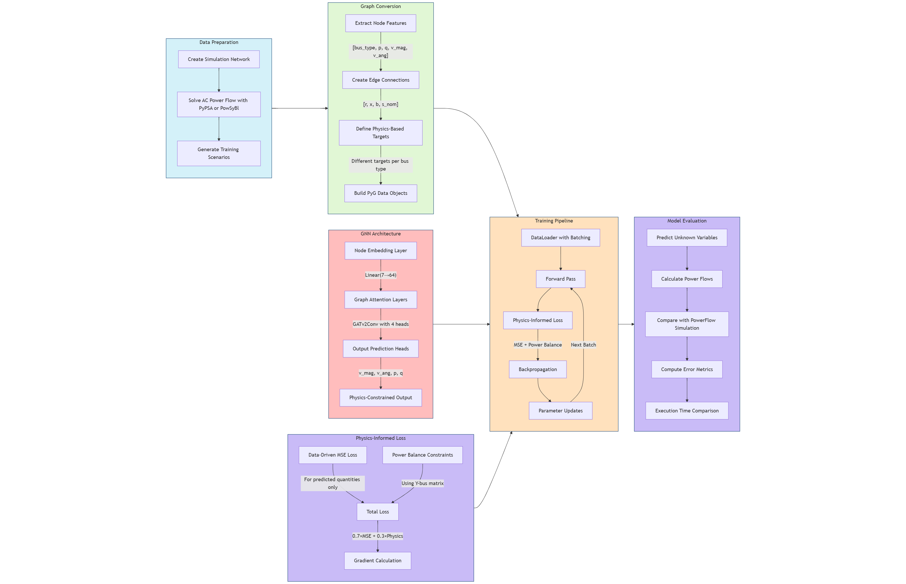
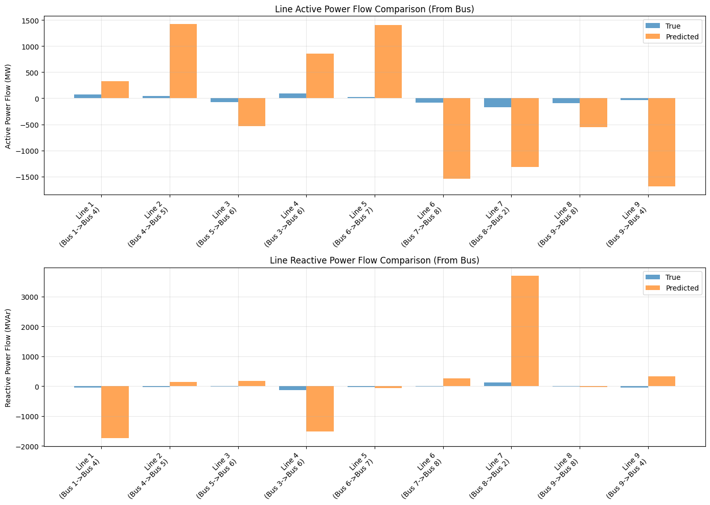
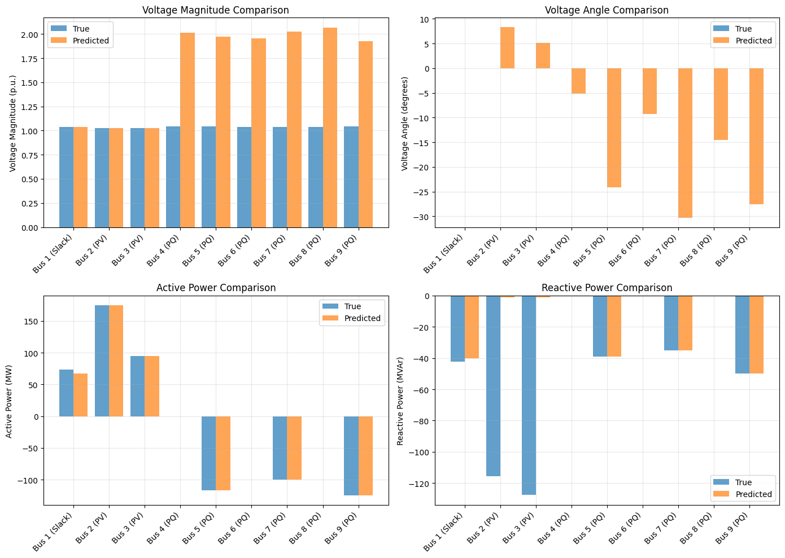

# Chapter 3
# Graph Neural Networks: Key Principles

Graph Neural Networks (GNNs) are specialized neural networks designed to work with graph-structured data. Understanding the mathematical foundations is essential for implementing and working with GNNs effectively.

## Vector Norms

Different norms are used to measure vector lengths and distances:

- **L₁ norm**: Sum of absolute values of components
\\[\lVert x\rVert_{1} = \sum_{i=1}^{n}|x_i|\\]

- **L₂ norm**: Euclidean distance 
  \\[ \lVert x \rVert_2 = \left(\sum_{i=1}^{n}|x_i|^2 \right)^{1/2}\\]

- **L∞ norm**: Maximum absolute value
  $$||x||_\infty = \max_i|x_i|$$

Distance between vectors x₁ and x₂ can be defined as:
$$D_p(x_1,x_2) = ||x_1-x_2||_p$$

## Matrix Operations

GNNs rely heavily on matrix representations and operations:

- Matrices are represented as m×n arrays of values
- Matrix multiplication transforms data through neural network layers
- For matrices A ∈ ℝᵐˣⁿ and B ∈ ℝⁿˣᵖ, their product C = AB ∈ ℝᵐˣᵖ

## Linear Independence

Vectors x₁, x₂, ..., xₘ are linearly independent only if there does not exist a set of scalars λ₁, λ₂, ..., λₘ (not all zero) such that:
$$\lambda_1x_1 + \lambda_2x_2 + ... + \lambda_mx_m = 0$$

This concept is important for understanding the expressiveness and limitations of GNN representations.

## Determinants

For an n×n matrix, the determinant is given by:
$$\text{Det}(A) = \sum_{k_1...k_n}(-1)^{\tau(k_1k_2...k_n)} a_{1k_1}a_{2k_2}...a_{nk_n}$$

Where k₁...kₙ are permutations of 1...n, and τ(k₁...kₙ) is the inversion number.

These mathematical foundations provide the basis for implementing message passing, node embedding, and graph representation learning that are central to GNN operations.

# Graph Neural Networks: Key Principles

Graph Neural Networks (GNNs) are specialized neural networks designed to work with graph-structured data. Understanding both the mathematical foundations and practical implementation details is essential for effectively applying GNNs to problems like power flow analysis.

## Mathematical Foundations

### Graph Representation

A graph is denoted as G = (V, E), where:
- V is the set of vertices (nodes)
- E is the set of edges

Graphs can be represented algebraically using:
- **Adjacency Matrix (A)**: Represents connections between nodes
- **Degree Matrix (D)**: Diagonal matrix showing number of connections per node
- **Laplacian Matrix (L)**: L = D - A
- **Incidence Matrix (M)**: Represents node-edge relationships where:
  $$
  M_{ij} = \begin{cases}
    1 & \text{if } \exists k \text{ s.t. } e_k = \{v_i, v_j\} \\
    -1 & \text{if } \exists k \text{ s.t. } e_k = \{v_j, v_i\} \\
    0 & \text{otherwise}
  \end{cases}
  $$

## GNN Architecture Components

### Attention Mechanism

The Graph Attention Network (GAT) uses attention coefficients to weight the importance of different neighbors:

1. **Attention Coefficient Calculation**:
   $$e_{ij} = a[Wh_i || Wh_j]$$
   Where:
   - a is the weight matrix of the multi-level perceptron (MLP)
   - W transforms the original node features
   - || represents concatenation
   - LeakyReLU adds non-linearity

2. **Attention Weight Normalization**:
   $$\alpha_{ij} = \text{softmax}(e_{ij}) = \frac{\exp(e_{ij})}{\sum_{k\in N_i} \exp(e_{ik})}$$

3. **Mathematical Simplification**:
   The attention mechanism can be simplified to:
   $$\alpha_{ij} = \frac{\exp(a_{:,d/2:} \cdot Wh_j)}{\sum_{k\in N_i} \exp(a_{:,d/2:} \cdot Wh_k)}$$

### Multi-Head Attention

Multiple attention mechanisms are computed in parallel and either:
- Concatenated for intermediate layers
- Averaged for the final layer

## Training Process

GNN training follows these steps:

1. **Forward Pass**: Node states are iteratively updated using the transition function until convergence
2. **Loss Calculation**: The loss is computed as the sum of differences between target values (t_i) and output values (o_i) for supervised nodes
3. **Gradient Computation**: 
   $$\nabla L(W) = \frac{\partial \text{loss}}{\partial W} = \frac{\partial(\sum(t_i-o_i))}{\partial W}$$
4. **Weight Update**: Weights are updated according to the gradients
   $$W = W_{\text{old}} - \eta\nabla L(W)$$

## Power Flow Application

For power flow analysis with GNNs:

### Node Features
- Active power injection (P)
- Reactive power injection (Q)
- Voltage magnitude (V)
- Voltage angle (θ)
- Bus type (one-hot encoded: PQ/PV/Slack)

### Edge Features
- Resistance (R)
- Reactance (X)
- Susceptance (B)
- Transformer tap ratio (if applicable)

The GNN learns to predict the unknown electrical quantities based on the known values and network topology, providing a faster alternative to traditional power flow solvers.

## GNN for power flow predictions
As an example a GNN can be trained to predict power flows for a simple 9bus system by first generating some training data by running simulations with a convetional tool like PyPSA or PowSyBl, and then use this data to train and test a GNN to make predictions.

# GNN-Based Power Flow Analysis

This implementation uses Graph Neural Networks (GNNs) to predict power flow solutions for electrical networks, providing a faster alternative to traditional iterative solvers.

## Core Components

### 1. Data Preparation
The system converts PyPSA power networks into graph-structured data:
- **Nodes**: Represent buses with features including bus type (one-hot encoded), active power (P), reactive power (Q), voltage magnitude (V), and voltage angle (θ)
- **Edges**: Represent transmission lines and transformers with features including resistance (R), reactance (X), susceptance (B), and nominal power (S_nom)
- **Targets**: Different electrical quantities are predicted based on bus type:
  - PQ buses: Predict V and θ (known P and Q)
  - PV buses: Predict θ and Q (known P and V)
  - Slack bus: Predict P and Q (known V and θ)

### 2. GNN Architecture
The model uses a Graph Attention Network (GAT) with:
- **Node Embedding Layer**: Transforms raw node features into a higher-dimensional space
- **Graph Attention Layers**: Learn to weight the importance of neighboring nodes using multi-head attention
- **Output Prediction Heads**: Separate prediction heads for voltage magnitude, voltage angle, active power, and reactive power
- **Physics-Constrained Output**: Enforces power system constraints by only predicting unknown quantities for each bus type

### 3. Physics-Informed Loss Function
The loss function combines:
- **Data-Driven Loss**: MSE between predictions and targets for quantities that should be predicted
- **Physics-Based Loss**: Enforces Kirchhoff's laws using the admittance matrix (Y-bus) to ensure predictions satisfy power balance constraints
- **Weighted Combination**: Balances data-driven learning (70%) with physics constraints (30%)

### 4. Training Pipeline
The training process includes:
- Batched processing of multiple power system scenarios
- Learning rate scheduling to improve convergence
- Validation to monitor model performance
- Checkpoint saving to retain the best model

### 5. Evaluation
The model is evaluated by:
- Comparing predictions with traditional power flow solutions
- Calculating metrics including MAE for voltage, power, and line flows
- Measuring execution time compared to traditional solvers
- Visualizing results to verify physical consistency

in figure 1 a flow chart of the workflow is shown.

*Figure 1 GNN for Power Flow workflow*

The preliminary results shown in figure 2 and 3 shows a working (althoug with very poor prediction) GNN.

*Figure 2 GNN for Power Flow Predictions - lineflow*

*Figure 2 GNN for Power Flow Predictions - bus results*

## References

- [GNN_overview.ipynb](https://github.com/phlippe/uvadlc_notebooks/blob/master/docs/tutorial_notebooks/tutorial7/GNN_overview.ipynb)
- [Introduction to Graph Neural Networks](https://link.springer.com/book/10.1007/978-3-031-01587-8)
- [GNN TensorFlow](https://arxiv.org/pdf/2207.03522)

### Graph Nerual Networks Fundamentals
Graph neural networks : https://web.stanford.edu/class/cs224w/
https://www.cs.mcgill.ca/~wlh/grl_book/
Lecture 1, 2 and 3 (30 pages)

### Power flow orientet GNN
M. Gao, J. Yu, Z. Yang, og J. Zhao, «Physics Embedded Graph Convolution Neural Network for Power Flow Calculation Considering Uncertain Injections and Topology», IEEE Transactions on Neural Networks and Learning Systems, bd. 35, nr. 11, s. 15467–15478, nov. 2024, doi: 10.1109/TNNLS.2023.3287028.
12 pages

C. Li mfl., «Optimal Power Flow in a highly renewable power system based on attention neural networks», Applied Energy, bd. 359, s. 122779, apr. 2024, doi: 10.1016/j.apenergy.2024.122779.
10 pages

B. Donon, R. Clément, B. Donnot, A. Marot, I. Guyon, og M. Schoenauer, «Neural networks for power flow: Graph neural solver», Electric Power Systems Research, bd. 189, s. 106547, des. 2020, doi: 10.1016/j.epsr.2020.106547.
12 pages

